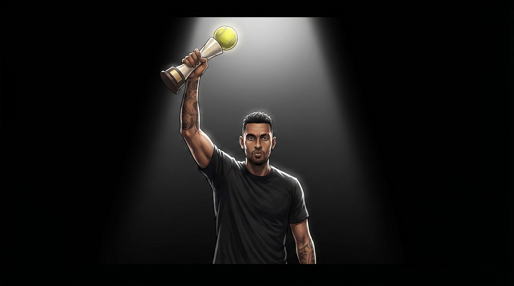

# Phase 2 — "The Kyrious Ball Launch"

**Asset**: Phase 2 hero video (Super Bowl / infomercial style)
**Tone**: ridiculous American infomercial, over-the-top science, high-energy revenge
**Tagline**: *Bye little lemon. You're served.*

> Source: [PT2 Notion](https://www.notion.so/carenbloom/PT2-HELLO-NANCY-x-NICK-KYRGIOS-350af6a343728053928ffef474c8d691) — Crystal Lo

## The twist
Nick "fights back" by engineering his own product — the **KYRIOUS BALL** (a tennis-ball-headed wand vibrator). The reveal: it's still a HelloNancy product, stamped with the iconic "N." The whole feud was the launch.

## Six-scene structure

### Scene 1 — The Pleasure Lab
**Location**: high-tech lab, neon blue/pink, filled with tennis equipment
**Visual**: Nick in lab coat + safety goggles. Walls covered with a vision board ("MAKE HER HAPPY", "THE SPOT" circled), ANTI-LEMON propaganda ("ENEMY #1"), "LEMONS ARE NOT TOYS." Whiteboard: *DAYS WITHOUT THINKING ABOUT THE LEMON: 0*. Tennis balls in various states of dissection.
**Beat**: direct-to-camera intensity — *"They thought they could beat me with a lemon. So I became a scientist."*

📷 

### Scene 2A — The Research (Focus Group)
**Visual**: long conference table, real women laughing as Nick takes furious notes on a yellow legal pad. Title-card counter: *"10,247 WOMEN INTERVIEWED."*
**Comedic beats**:
- Nick: *"So… not a serve. More like a drop shot?"*
- Women, in unison: *"Oh my god, no."*
- Cross-legged on the floor like a kindergartener, hand raised: *"Is it always in the same spot? Or does it move?"*

### Scene 2B — The Doctor (anatomy)
**Visual**: female doctor with anatomical diagram, pointer stick. Nick takes notes like a student.
**Beat**: she points; he leans in, squints. *"That's it?! That's TINY. That's smaller than the sweet spot on a racket!"*
> "And yet, it has 8,000 nerve endings."

Nick's pen drops. Whisper to camera: *"Eight… thousand."*

> ⚠️ **Tone calibration note**: this scene needs careful direction so the joke lands as Nick's earnest cluelessness, not condescension toward women. The doctor and the focus-group women should consistently be the smartest people on screen.

### Scene 2C — Chalkboard Breakthrough
**Visual**: glass chalkboard covered in fake equations + research notes — *"8,000 NERVE ENDINGS"* circled five times, *"NOT A SERVE"* underlined, *"LISTEN TO WOMEN ★★★"*, an earnest crude anatomical drawing.
**Beat**: Nick taps the board, dead serious. *"I studied the tape. I analyzed the data. I interviewed ten thousand, two hundred and forty-seven women. I sat with doctors. I asked the hard questions."*
Pause. Soft turn: *"Turns out, it's a lot smaller than a tennis ball. But it's the most important thing on the court. And that didn't stop me."*

### Scene 3 — The Engineering
**Visual**: slow-motion montage to dramatic classical score
**Beat**: Nick places a yellow-green tennis ball on a sleek cream wand base. Presses button. The ball blurs with vibration. Single tear of triumph.
**V.O.**: *"I engineered the perfect grip. The perfect fuzz-to-vibration ratio. I created a monster."*

### Scene 4 — Packaging
**Visual**: wall of prototypes; Nick holds the final V4 box (tall, cream, blue vertical type, circular tennis-ball window).
**Beat**: smug salesman delivery — *"It's tall. It's minimal. It says 'I play to win, but I also respect typography.'"*
Turns the box: *"And yeah, I kept the 'N'. Because I'm Nick. Obviously."*

📷 

### Scene 5 — The Declaration
**Visual**: dramatic spotlight in a dark studio. Nick holds the Kyrious Ball like a championship trophy.
**Beat**: whispered intensity into the lens —
> *"You wanted a rally, HelloNancy? You got one. Tomorrow, everything changes. You're served."*

📷 

### Scene 6 — Title card
SMASH CUT TO BLACK.
> **bye little LEMON**

HelloNancy logo + Kyrious Ball silhouette flash. Single THWACK SFX.

## Phase 2 teaser ladder

| Window | Format | Hook |
|---|---|---|
| **Reveal week** | Macro tennis-ball texture | *"tomorrow everything changes"* — 24h countdown |
| **Reveal day -1** | Dark moody Nick + glowing ball | *"you are served, hellonancy.com"* |
| **Reveal moment** | Spotlit ball-with-hole | *"bye little lemon"* — Apple-keynote drama |

## Open production questions
- [ ] Real product or film prop? (drives entire downstream cost: tooling, FCC, fulfillment)
- [ ] If real: SKU pricing tier, dropshipping/warehouse, return policy
- [ ] Doctor casting — needs warmth + authority, not a punchline character
- [ ] Focus-group casting — diverse, real, non-actors preferred

## Tone references
- Nutrl × Shane Gillis (Super Bowl 2025) — athlete-led infomercial energy
- Old Spice "The Man Your Man Could Smell Like" — confidence + absurdity
- Liquid Death advertorials — straight-faced product deck satire
